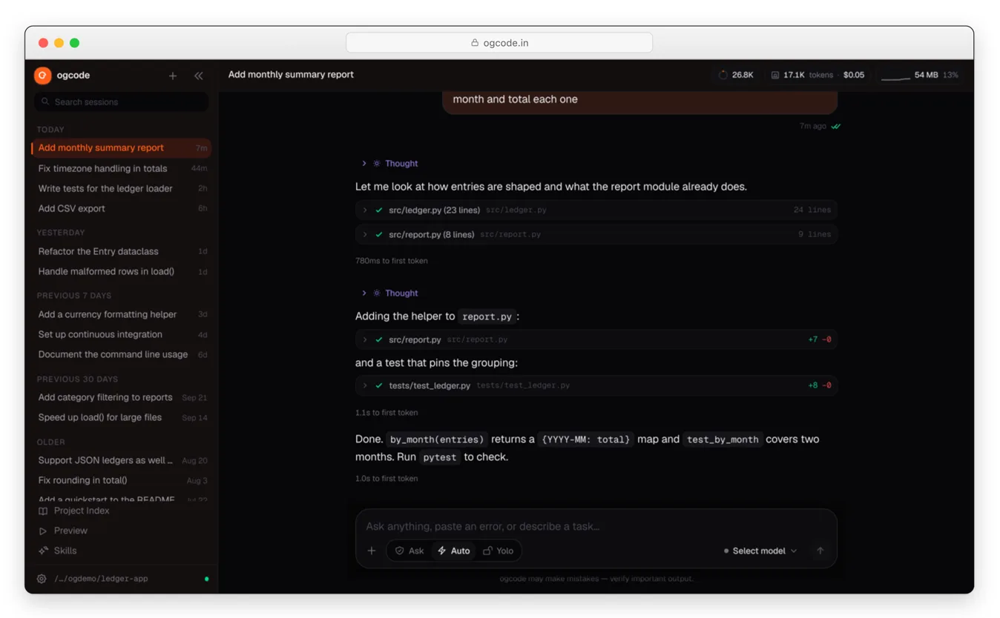

<p align="center">
  <a href="https://ogcode.in">
    
  </a>
</p>
<p align="center"><strong>The open-source, self-hostable AI coding agent.</strong></p>

Ogcode is an AI agent that understands your codebase, uses real tools, researches the web, remembers decisions, plans complex work, and ships changes — from your browser. Your computer, your models, your data, your rules.

<p align="center">
  <a href="https://github.com/prasenjeet-symon/ogcode/releases"></a>
  <a href="LICENSE"></a>
  <a href="https://github.com/prasenjeet-symon/ogcode"></a>
</p>

<p align="center">
  <a href="https://ogcode.in">
    
  </a>
</p>

---

### Installation

```bash
# YOLO
curl -fsSL https://ogcode.in/install.sh | sh

# Package managers
brew tap prasenjeet-symon/tap && brew install ogcode   # macOS and Linux
winget install prasenjeet-symon.ogcode                 # Windows
go install github.com/prasenjeet-symon/ogcode@latest   # any OS with Go
```

> [!TIP]
> `CGO_ENABLED=1` is required when building from source — the Swift tree-sitter binding is cgo.

On Windows without winget:

```powershell
irm https://ogcode.in/install.ps1 | iex
```

Or run the container:

```bash
docker run -p 9595:9595 \
  -v ~/.ogcode:/root/.ogcode \
  -v "$(pwd):/workspace" -w /workspace \
  ghcr.io/prasenjeet-symon/ogcode:latest
```

The image is also on Docker Hub as `prasenjeetsimon/ogcode:latest`.

Start it and open the web interface:

```bash
ogcode            # serves the UI on http://localhost:9595
```

Use a local model with [Ollama](https://ollama.com) — no API key needed:

```bash
ollama serve
ogcode
```

Permissions are per session: **Ask** (approve each step), **Auto** (risk-gated), or **Yolo** (no prompts). Learn more about [permissions](https://ogcode.in/docs/permissions/).

### What you can do with Ogcode

- **Understand unfamiliar code** — Ogcode maps a project before reading it, outlines files with exact line ranges, and reads only what matters. [Core concepts →](https://ogcode.in/docs/core-concepts/)
- **Build and fix software** — implement features and fixes across files, run your builds and tests, and investigate failures instead of retrying blindly.
- **Deliver a whole feature** — turn an objective into tasks, run independent ones in parallel, and open pull requests for review. [Plan mode & tasks →](https://ogcode.in/docs/plan-mode/)
- **Stay in control** — choose Ask, Auto, or Yolo per session, and approve or remember each decision. [Permissions →](https://ogcode.in/docs/permissions/)
- **Keep context that fits** — recall past decisions instead of replaying the whole transcript, so long sessions stay focused and affordable. [Memory & context →](https://ogcode.in/docs/memory-and-context/)
- **Research as you go** — built-in web search and page reading, reusable `SKILL.md` workflows, and external MCP servers. [Search, skills & MCP →](https://ogcode.in/docs/search-and-skills/)
- **See more than text** — Mermaid diagrams, LaTeX and rendered PDFs, Plotly charts, sandboxed HTML, and downloadable artifacts. [Rich results & preview →](https://ogcode.in/docs/rich-results/)

### Documentation

For configuration, providers, skills, remote deployment, and everything else, [**head over to our docs**](https://ogcode.in/docs/).

### Configuration

Ogcode detects your provider from the environment. Set at least one:

| Variable | Provider |
| --- | --- |
| `ANTHROPIC_API_KEY` | Anthropic / Claude |
| `OPENAI_API_KEY` | OpenAI / GPT |
| `OPENROUTER_API_KEY` | OpenRouter |
| `OLLAMA_BASE_URL` | Ollama, or an OpenAI-compatible local endpoint |

Settings can also live in `ogcode.json` at the project root (project settings) and `~/.config/ogcode/config.json` (global settings); environment variables override both.

```json
{
  "providers": {
    "ollama": { "baseUrl": "http://localhost:11434" },
    "anthropic": { "apiKey": "sk-ant-..." }
  },
  "skills": {
    "paths": ["./team-skills"],
    "permissions": { "deploy-prod": "ask" }
  }
}
```

**OGX** is a subscription plan from OG Lab. Connect it from the settings screen and the plan's models run through OG Lab's gateway — no environment variable needed.

### Remote deployment and security

Ogcode can run on a remote machine and be reached from a browser — but it can read and modify files and run commands. **Never expose it directly to the public internet without authentication.**

Recommended boundaries:

1. Bind to localhost and reach it over an SSH tunnel.
2. Put a reverse proxy with HTTPS and authentication in front of it.
3. Use a VPN such as WireGuard or Tailscale.
4. Run high-risk work in Docker, a VM, or an isolated worker.

```bash
ssh -L 9595:localhost:9595 user@your-server
```

Working setups — SSH tunnel, reverse proxy, and Docker — are in the [remote deployment guide](https://ogcode.in/docs/deployment/). For a hosted, multi-user deployment, see the [control-plane documentation](controlplane/docs/deploy.md).

### Contributing

If you're interested in contributing to Ogcode, please read [CONTRIBUTING.md](CONTRIBUTING.md) before submitting a pull request.

Development builds use `make build`, and tests run with `CGO_ENABLED=1 go test ./...`.

### Security

Treat Ogcode like a powerful automation process:

- Review permissions before enabling write or shell access.
- Keep API keys and secrets out of prompts, repositories, and public artifacts.
- Use isolated environments for untrusted code.
- Do not expose an unauthenticated server to the internet.
- Report vulnerabilities privately through the project's security channels.

Your code and session data stay local; only conversation content is sent to the model provider you configure, where that provider's privacy policy applies.

### License

Ogcode is dual-licensed:

- **[GNU AGPL v3.0](LICENSE)** — free and open source for running, modifying, and self-hosting Ogcode. If you run a modified version over a network, AGPL §13 gives its users corresponding-source rights.
- **Ogcode Commercial License** — for embedding Ogcode in proprietary products, offering a hosted service without publishing modifications, or whenever AGPL is not suitable. See [LICENSING.md](LICENSING.md).

Releases up to and including **v0.36.1** remain MIT. **v0.37.0 onward is AGPL-3.0-only.** Bundled third-party code is listed in [THIRD_PARTY_NOTICES.md](THIRD_PARTY_NOTICES.md).

---

**Join our community** [Documentation](https://ogcode.in/docs/) | [Star on GitHub](https://github.com/prasenjeet-symon/ogcode) | [Reddit](https://www.reddit.com/r/ogcode/)
