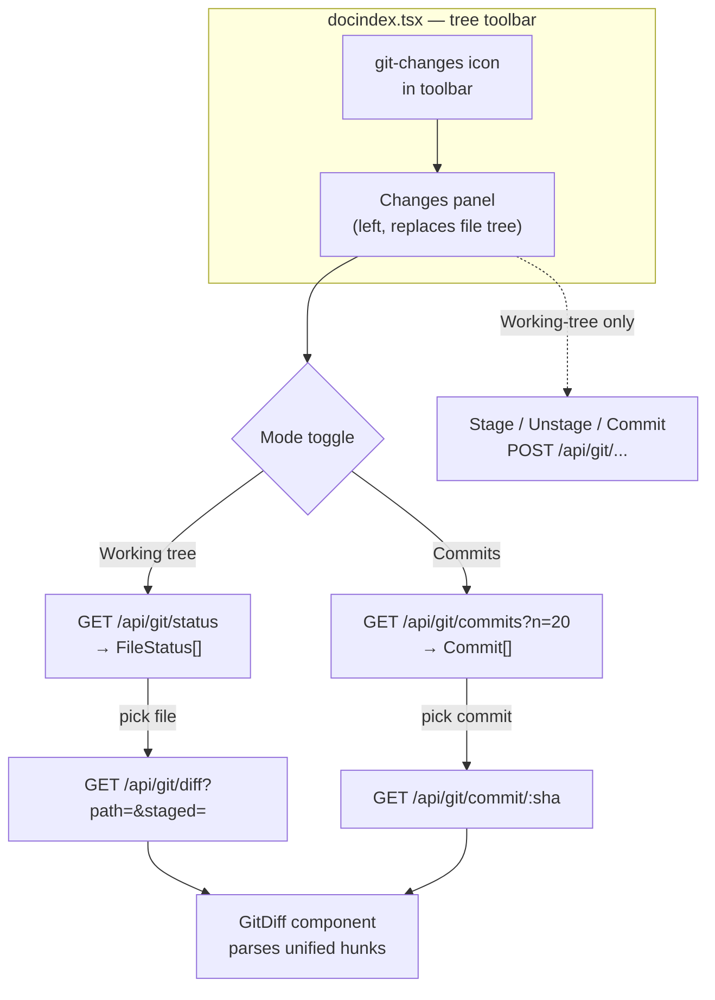
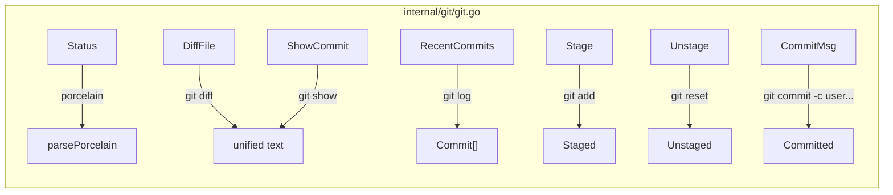

# Git Working-Tree & Commit Diff Viewer — Implementation Plan

## Goal

Give the user a VS Code-style "Source Control" view inside the ogcode index
explorer page (`web/src/pages/docindex.tsx`): list changed files in the working
tree, show per-file diffs, stage/unstage, commit, and browse recent commits.
This replaces today's invisible, silent auto-commit (`CommitAllChanges`) with an
explicit review-then-stage-then-commit gate — while still leaving the agent's
auto-commit path intact.

## Current state (what already exists)

| Layer | What's there | What's missing |
|---|---|---|
| `internal/git/git.go` | `runGit` / `runGitOutput` plumbing, `CommitAllChanges`, `GetCurrentBranch`, `BranchSyncStatus`, local-identity override (`-c user.name=ogcode`) | `status --porcelain`, `diff`, `show`, `log`, `add`, `reset`, `commit` as reusable helpers |
| `internal/server/routes.go` | `/api/git/sync`, `/api/vcs` | no `/api/git/status`, `/diff`, `/commits`, `/commit/:sha`, `/stage`, `/commit` routes |
| `internal/server/config_routes.go` | `handleGitSync`, `handleVCS` | handlers for the new routes |
| `web/src/api/client.ts` | `getGitSync`, `getVCS` | git status/diff/commit client functions |
| `web/src/pages/docindex.tsx` | file tree + viewer, tree toolbar with expand/collapse/filter buttons | a "Changes" toggle + panel in the toolbar |
| `web/src/components/file-diff.tsx` | `FileDiff` (needs full `oldText`/`newText`, computes via `diffLines`), `DiffRow` renderer | a `GitDiff` component that parses **raw unified-diff text** and renders hunks directly |

**Key constraint:** `FileDiff` cannot be reused for git diffs. It needs both full
file versions to recompute a line diff. Reconstructing those from a unified diff
is fragile and wrong for large files. The new `GitDiff` component parses
`@@ ... @@` hunks straight from `git diff`/`git show` output — the way VS Code
and GitHub actually do it. It reuses `FileDiff`'s visual style (`DiffRow`).

## Architecture





## Phases

The plan is broken into 5 phases. Each phase is independently shippable: it
builds, tests pass, and the UI has something new and usable at the end. Phases
1–4 build the working-tree review flow (the priority). Phase 5 adds commit
browsing on top. **Do not start a phase until the previous one builds and tests
clean.**

---

### Phase 1 — Backend git helpers (read-only: status, diff, log, show)

**Files:**
- `internal/git/git.go` — add new helper functions + types
- `internal/git/git_test.go` (new) — table-driven tests for the porcelain + log parsers

**Add to `internal/git/git.go`:**

```go
// FileStatus is one entry from `git status --porcelain`.
type FileStatus struct {
    Path   string `json:"path"`   // workspace-relative
    X      string `json:"x"`      // index/staged state code, e.g. "M", "A", " ", "?"
    Y      string `json:"y"`      // worktree state code
    Staged bool   `json:"staged"` // true when X is non-blank and not "?"
}

// Commit is one entry from `git log --format=...`.
type Commit struct {
    SHA     string `json:"sha"`
    Short   string `json:"short"`
    Message string `json:"message"` // subject line only
    Author  string `json:"author"`
    Time    string `json:"time"`     // ISO 8601
}
```

Functions (all thin wrappers over existing `runGitOutput`):

1. `Status(dir string) ([]FileStatus, error)`
   - `git status --porcelain -z` (NUL-separated, handles paths with spaces)
   - Parse each record: XY codes (2 chars) + path. For renames (`R`), split on
     ` → ` and keep the new path as `Path`; record `X`/`Y` separately.
   - `Staged = X != " " && X != "?"`.
   - Return `nil, nil` (not an error) when the working tree is clean.

2. `DiffFile(dir, path string, staged bool) (string, error)`
   - Unstaged: `git diff -- <path>`
   - Staged:   `git diff --cached -- <path>`
   - Returns raw unified diff text (or `""` when the file has no changes at
     that level). Use `--no-color`. No binary patch rendering — if git emits
     `Binary files ... differ`, return that text; the frontend shows it as-is.

3. `ShowCommit(dir, sha string) (string, error)`
   - `git show --no-color <sha>`
   - Returns the full unified diff for that commit (raw text).

4. `RecentCommits(dir string, n int) ([]Commit, error)`
   - `git log -n <n> --format=%H%x01%h%x01%s%x01%an%x01%aI` (NUL... actually use
     a rare separator: `%x01` ASCII 0x01 between fields, `%x00` between commits)
   - Parse into `[]Commit`. Default `n` to 20 when `n <= 0`.

**Tests (`internal/git/git_test.go`):**
- `TestParsePorcelain` — feed sample porcelain bytes, assert `[]FileStatus`
  (incl. a renamed file and an untracked file).
- `TestParseLog` — feed sample log output, assert `[]Commit`.
- These test the pure parsers, which is where bugs hide; the shell-out
  wrappers are exercised by an integration test that runs in a temp repo (see
  Phase 4). Keep parsers as separate unexported funcs so they're testable
  without `exec.Command`.

**Verification:**
- `CGO_ENABLED=1 go build ./...`
- `CGO_ENABLED=1 go test ./internal/git/...`

**Done when:** the four helpers compile, the two parsers pass their tests, and
`go vet ./internal/git/...` is clean.

---

### Phase 2 — HTTP routes (read-only: status, diff, commits, commit detail)

**Files:**
- `internal/server/routes.go` — register the new routes under `/api/git`
- `internal/server/git_routes.go` (new) — the handlers
- `internal/server/git_routes_test.go` (new) — handler tests using `httptest`

**Routes (add to the `/api` group in `routes.go`):**

| Method | Path | Handler | Purpose |
|---|---|---|---|
| GET | `/api/git/status` | `handleGitStatus` | `[]FileStatus` for `s.dir` |
| GET | `/api/git/diff` | `handleGitDiff` | unified diff; `?path=` (req), `?staged=true` |
| GET | `/api/git/commits` | `handleGitCommits` | `[]Commit`; `?n=` (default 20) |
| GET | `/api/git/commit/{sha}` | `handleGitCommit` | unified diff for one commit |

All handlers:
- Read the directory from `s.dir` (the server's working directory) — no
  per-request directory override for now, matching `handleGitSync`.
- On git failure, respond `500` with the error message (same shape as
  `handleGitSync`).
- Use `writeJSON` (already in `session_routes.go`).
- Guard against non-git directories: `Status`/`RecentCommits` return empty
  arrays + a top-level `isRepo: false` flag; `DiffFile`/`ShowCommit` return
  `404` with a clear message.

**Handler shape (`handleGitDiff`):**
```go
func (s *Server) handleGitDiff(w http.ResponseWriter, r *http.Request) {
    path := r.URL.Query().Get("path")
    if path == "" {
        http.Error(w, "missing path", http.StatusBadRequest)
        return
    }
    staged := r.URL.Query().Has("staged")
    out, err := git.DiffFile(s.dir, path, staged)
    if err != nil {
        http.Error(w, err.Error(), http.StatusInternalServerError)
        return
    }
    writeJSON(w, http.StatusOK, map[string]any{"diff": out})
}
```

**Tests:** use `httptest.NewServer` + a temp git repo created in `t.TempDir()`,
wired into a minimal `Server` with just `dir` set. Assert status codes and
JSON shapes for: clean tree, one modified file, one staged file, one new commit
reachable via `/commits` then `/commit/{sha}`.

**Verification:**
- `CGO_ENABLED=1 go build ./...`
- `CGO_ENABLED=1 go test ./internal/server/...`
- `gofmt -w internal/server/git_routes.go internal/server/routes.go`

**Done when:** all four read-only routes return correct JSON, handler tests
pass, and the routes are wired into `routes.go`.

---

### Phase 3 — Frontend: `GitDiff` component + API client functions

**Files:**
- `web/src/components/git-diff.tsx` (new) — parses unified diff text, renders hunks
- `web/src/api/client.ts` — add `GitFileStatus`, `GitCommit`, and four fetch functions

**`GitDiff` component (`web/src/components/git-diff.tsx`):**

Props: `{ diff: string; filename?: string }`.

Parses raw unified-diff text into hunks. A hunk =
- header line `@@ -a,b +c,d @@ <optional section>`
- body lines starting with ` ` (context), `+` (add), `-` (del), `\` (hunk header
  "\ No newline..." — render as a muted note row)

Render:
- Reuse the visual style of `FileDiff` / `DiffRow`: same `bg`/`gutter`/`textColor`
  scheme (`rgba(16,185,129,0.10)` for adds, `rgba(239,68,68,0.10)` for dels).
- Show a hunk header row (muted, full width) before each hunk's lines.
- Cap rows at `MAX_ROWS = 600` (same constant as `FileDiff`) with an
  "… N more lines" footer.
- When `diff` is empty → render a "No changes" muted block.
- When `diff` starts with "Binary files" → render that text as a muted note.
- Strip the diff/file header lines (`diff --git`, `index ...`, `+++`, `---`)
  from the rendered rows — only `@@` headers and body lines are shown. (Parse
  them enough to extract the filename for the optional header, but don't
  render them as diff rows.)

Implementation notes:
- Do **not** depend on the `diff` npm package. Parsing `@@` hunks is ~40 lines
  of string work; pulling in a diff lib to re-render a diff is backwards.
- Keep the parser a pure exported function `parseUnifiedDiff(text): Hunk[]` so
  it can be unit-tested in isolation.

**API client additions (`web/src/api/client.ts`):**

```ts
export interface GitFileStatus {
  path: string;
  x: string;
  y: string;
  staged: boolean;
}
export function getGitStatus(directory?: string): Promise<{ isRepo: boolean; files: GitFileStatus[] }>

export interface GitCommit {
  sha: string;
  short: string;
  message: string;
  author: string;
  time: string;
}
export function getGitCommits(directory?: string, n?: number): Promise<GitCommit[]>
export function getGitCommitDiff(sha: string, directory?: string): Promise<{ diff: string }>
export function getGitFileDiff(path: string, staged: boolean, directory?: string): Promise<{ diff: string }>
```

All four hit the Phase 2 routes. `directory` param follows the existing
`?directory=` convention used by the docindex endpoints.

**Verification:**
- `cd web && npm run build` (must succeed — `--legacy-peer-deps` only needed at
  install time; build itself is `tsc` + Vite)
- Manual: temporarily wire `GitDiff` into a throwaway route with a sample diff
  string to eyeball the rendering. (Not committed.)

**Done when:** `GitDiff` renders a sample unified diff correctly, the client
functions type-check, and `npm run build` passes.

---

### Phase 4 — Frontend: "Changes" panel in the index explorer (working-tree flow)

**Files:**
- `web/src/pages/docindex.tsx` — add the toolbar icon + Changes panel + state
- (no new components beyond `GitDiff` from Phase 3)

**UI design:**

1. **Toolbar icon.** Add a git-changes icon button to the tree toolbar (next to
   expand/collapse), with a small badge showing the count of changed files when
   > 0. Clicking toggles `showChanges` signal. Reuse the `iconBtn` class already
   used by expand/collapse for visual consistency.

2. **Changes panel.** When `showChanges` is true, the left tree pane is
   replaced (not overlaid) by a "Changes" list:
   - Flat list of `GitFileStatus` entries, each row showing:
     - a status badge (`M` / `A` / `D` / `??` — derived from `x`/`y`; staged
       entries get a filled badge, unstaged an outlined one)
     - the basename, with the dir path muted underneath (two-line row, like
       VS Code's Source Control)
   - Clicking a row fetches `getGitFileDiff(path, staged)` and renders
     `GitDiff` in the right-hand detail pane (the same pane that today shows
       `CodeViewer`).
   - A header above the list: "Changes" + a refresh button + (in this phase,
     read-only; stage/commit buttons come in Phase 4b).

3. **Refresh.** The panel fetches status on mount and on a manual refresh
   click. Also re-fetch when the panel is first opened (the agent may have
   edited files while it was closed).

4. **State.** New signals in `DocIndexPage`:
   - `showChanges: boolean`
   - `gitStatus: GitFileStatus[]`
   - `selectedChange: { path: string; staged: boolean } | null`
   - `changeDiff: string` (resource, fetched from `selectedChange`)
   - Keep these entirely separate from the file-tree signals so toggling back
     to the tree doesn't lose tree state.

**Phase 4b — Stage / Unstage / Commit (can be a follow-up commit within Phase 4):**

This requires Phase 5's backend write routes, so it's listed here for UI
planning but implemented after the write backend exists. UI:
- Each row gets a per-file stage/unstage icon button (staged rows show
  "unstage", unstaged show "stage").
- A footer bar in the Changes panel: a commit-message input + "Commit"
  button. "Commit" calls the commit route with the message (staging all by
  default, or honoring only staged files — decide in Phase 5).

**Verification:**
- `cd web && npm run build`
- Manual: make a file change in the working tree, open the panel, see the file
  listed, click it, see the diff.

**Done when:** the Changes panel lists working-tree changes, clicking a file
shows its unified diff in the detail pane, and `npm run build` passes.

---

### Phase 5 — Backend write routes (stage, unstage, commit) + commit-browsing UI

This phase has two independent halves. Do the backend half first.

**5a. Backend write routes**

**Files:** `internal/git/git.go`, `internal/server/routes.go`,
`internal/server/git_routes.go`

Add to `internal/git/git.go`:
- `Stage(dir string, paths []string) error` — `git add -- <paths...>` (no `-A`;
  explicit paths only, so the user controls scope). Empty `paths` is a no-op.
- `Unstage(dir string, paths []string) error` — `git reset HEAD -- <paths...>`.
- `Commit(dir, msg string) error` — reuse the local-identity override from
  `CommitAllChanges` (`-c user.name=ogcode -c user.email=ogcode@local commit -m
  msg`). Returns a clear error when there's nothing staged.

Add routes:
| Method | Path | Handler | Body |
|---|---|---|---|
| POST | `/api/git/stage` | `handleGitStage` | `{ paths: string[] }` |
| POST | `/api/git/unstage` | `handleGitUnstage` | `{ paths: string[] }` |
| POST | `/api/git/commit` | `handleGitCommitCreate` | `{ message: string }` |

All three must take `s.gitMu` (the existing repo-operation lock) to avoid
racing the agent's own `CommitAllChanges`. This is the one real concurrency
hazard: if the user commits while the agent is mid-`CommitAllChanges`, git's
index lock will reject one of them. Serialize on `gitMu`.

Decision for 5a: **"Commit" commits only staged files** (not `-A`). This honors
the review gate — the user explicitly staged what they want. If nothing is
staged, return `400` with "Nothing staged to commit." This differs from
`CommitAllChanges` (which does `add -A`) deliberately: the UI flow is
review-then-stage-then-commit, not bulk-commit.

Tests: extend `git_routes_test.go` — stage a file, assert it leaves the
unstaged list; commit staged, assert the commit appears in `/commits`; commit
with nothing staged → `400`.

**5b. Commit-browsing UI**

**Files:** `web/src/pages/docindex.tsx`, `web/src/api/client.ts` (commits
client added in Phase 3)

Add a mode toggle at the top of the Changes panel: **Working tree** | **Commits**.
- **Working tree** = Phase 4's list + Phase 5a's stage/commit footer.
- **Commits** = a list of `getGitCommits(n=20)` entries (sha short + message +
  author + relative time). Clicking one fetches `getGitCommitDiff(sha)` and
  renders it in the same `GitDiff` detail pane. No stage/commit buttons in this
  mode.

**Verification:**
- `CGO_ENABLED=1 go test ./internal/git/... ./internal/server/...`
- `cd web && npm run build`
- Manual: stage + commit a file via the UI, switch to Commits mode, see the new
  commit, click it, see its diff.

**Done when:** the full review-stage-commit loop works end to end and the
commit browser shows recent commits with their diffs.

---

## Cross-cutting decisions (apply to all phases)

1. **Directory.** All routes operate on `s.dir` (the server's working
   directory, same as `handleGitSync`). No per-request `directory` override on
   the backend in Phase 1–5a. The frontend `directory?` param is threaded
   through the client functions for forward compatibility but defaults to the
   server's dir. (Task-worktree support is explicitly out of scope for this
   plan — see "Out of scope".)

2. **Concurrency.** Write routes (`stage`/`unstage`/`commit`) take `s.gitMu`.
   Read routes do not — they're side-effect-free and git's index lock isn't
   involved. This matches the existing pattern where only worktree
   add/remove/prune hold `gitMu`.

3. **No new dependencies.** The Go side uses only `exec.Command` + stdlib. The
   frontend `GitDiff` parser is hand-written — do not add a diff npm package.

4. **Reuse, don't fork, the visual style.** `GitDiff`'s row rendering copies
   `FileDiff`'s `DiffRow` color/gutter scheme exactly so diffs look consistent
   across the app. If the scheme is used in a third place, extract it to a
   shared module — but not preemptively.

5. **Testing.** Go: table-driven parser tests + `httptest` handler tests in a
   temp repo. Frontend: rely on `tsc`/Vite build + manual verification; no unit
   test framework is configured for the web side in this repo.

6. **Scope discipline.** Do not touch `CommitAllChanges` or the agent's
   auto-commit path. The new commit route is a **separate, user-driven**
   commit. If the user commits via the UI and the agent later runs
   `CommitAllChanges`, the latter becomes a no-op (nothing to stage) — safe.

## Out of scope (explicitly deferred)

- **Task-worktree diffs.** Plan-mode task worktrees may be deleted on
  completion (`RemoveTaskWorktree`), so a committed-diff view of a completed
  task can 404. This plan only covers the main working directory (`s.dir`).
  Task-worktree support is a follow-up that needs a "keep branch" precondition.
- **Per-file line-level staging (`git add -p`).** File-level staging only.
- **Branch switching / creating / merging from the UI.** That's version
  control management, not diff review.
- **Diff stats in the tree.** Badge counts on tree nodes (like GitHub's
  "3 changed") could be added later by cross-referencing `git status` paths
  with the tree, but it's not needed for the core review flow.

## Phase summary

| Phase | Delivers | Backend | Frontend |
|---|---|---|---|
| 1 | git helpers: status, diff, show, log | ✅ + tests | — |
| 2 | read-only HTTP routes | ✅ + tests | — |
| 3 | `GitDiff` component + API client | — | ✅ + build |
| 4 | Changes panel (working-tree list + diffs) | — | ✅ + build |
| 5a | write routes: stage, unstage, commit | ✅ + tests | — |
| 5b | commit-browsing UI | — | ✅ + build |

**Ship order:** 1 → 2 → 3 → 4 → 5a → 5b. Phases 1–4 give the working-tree
review flow (the priority). 5a adds the commit gate. 5b adds history browsing.